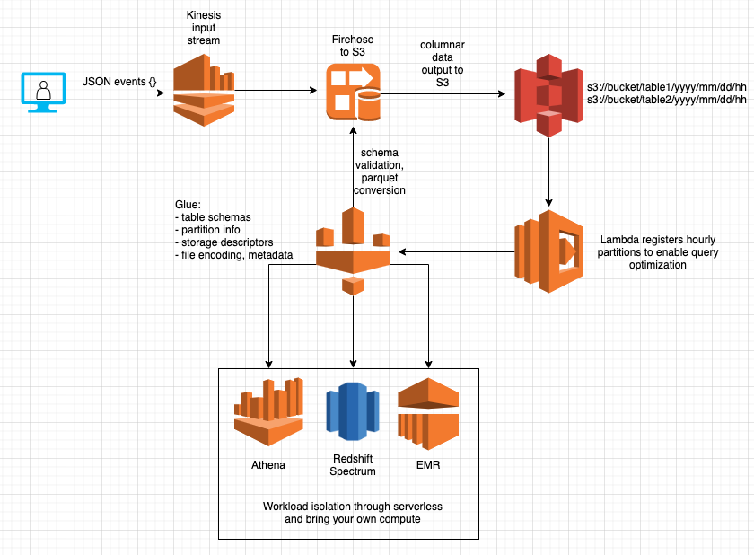

# Serverless Datawarehouse

A sample project that deploys a serverless data warehouse. This highly scalable data warehouse is pay as you go, scales read and write workload independently, and uses fully managed services.



## Deploy and run the program
1. Create a new stack
```sh
pulumi stack init dev
```

2. Install dependencies
```sh
npm install
```

3. Deploy

```sh
pulumi up
```

4. Open Athena in the AWS Console, and perform some queries:

```sql
select * from analytics_dw.clicks;
```

5. Clean up the stack
```
pulumi destroy
```

## Testing

### Unit Tests
```sh
npm run test:unit
```
### Integration Tests
There is an integration test that deploys a fresh stack, ingests sample data, and verifies that the data can be queried on the other end through Athena. 

Because `ServerlessDataWarehouse` statically names Glue Databases, the integration test will fail with a `409 conflict` if you already have a dev stack running.

```sh
# make sure you have run a pulumi destroy against your dev stack first
npm run test:int
```

## API

### `ServerlessDataWarehouse: class`
A container for your data warehouse that creates and manages a Glue Database, an S3 Bucket to store data, and another S3 bucket for Athena query results.

### Constructor

#### `ServerlessDataWarehouse(name: string, args?: DataWarehouseArgs, opts?: pulumi.ComponentResourceOptions)` 

Parameters:
- `name: string`: Name of the pulumi resource. Will also be used for the Glue Database.
- `args: DataWarehouseArgs`:
  - `database?: aws.glue.CatalogDatabase`: optionally provide an existing Glue Database.
  - `isDev?: boolean`: flag for development, enables force destroy on S3 buckets to simplify stack teardown. 


### Members:
- `dataWarehouseBucket: aws.s3.bucket`: Bucket to store table data.
- `queryResultsBucket: aws.s3.Bucket`: Bucket used by Athena for query output. 
- `database: aws.glue.CatalogDatabase`: Glue Database to hold all tables created through method calls.

### Methods: 
#### `withTable: function`

Creats a glue table owned by creates a Glue Table owned by `this.database` configured to read data from `${this.dataWarehouseBucket}/${name}`

Parameters:
- `name: string`: The name of the table. The table will be configured to read data from `${this.dataWarehouseBucket}/${name}`.
- `args: TableArgs`: 
  - `columns: input.glue.CatalogTableStorageDescriptorColumn[]`: Description of the schema.
  - `partitionKeys?: input.glue.CatalogTablePartitionKey[]`: Partition keys to be associated with the schema. 
  - `dataFormat?: "JSON" | "parquet"`: Specifies the encoding of files written to `${this.dataWarehouseBucket}/${name}`. Defaults to parquet. Will be used to configure serializers and metadata that enable Athena and other engines to execute queries. 

#### `withStreamingBatchInputTable: function`
Creates a table implements the above architecture diagram. It creates a Kinesis input stream for JSON records, a Glue Table, and Kinesis Firehose that vets JSON records against the schema, converts them to parquet, and writes files into hourly folders `${dataWarehouseBucket}/${tableName}/YYYY/MM/DD/HH`. Partitions are automatically registered for a key `inserted_at="YYYY/MM/DD/HH` to enable processing time queries. 

Parameters: 
- `name: string`: The name of the table. The table will be configured to read data from `${this.dataWarehouseBucket}/${name}`.
- `args: StreamingInputTableArgs`
  - `columns: input.glue.CatalogTableStorageDescriptorColumn[]`: Description of the schema.
  - `inputStreamShardCount: number`: Number of shards to provision for the input Kinesis steam. This is how you scale your write workload.
  - `region: string`: region to localize resources like Kinesis and Lambda
  - `partitionKeyName?: string`: Name of the `YYYY/MM/DD/HH` partition key. Defaulst to `inserted_at`.
  - `partitionScheduleExpression?: string` AWS Lambda cron expression used to schedule the job that writes partition keys to Glue. Defaults to `rate(1 hour)`. Useful for development or integration testing where you want to ensure that partitions are writtin in a timely manner. 


#### `withBatchInputTable: function`

Designed for batch loading tables on a regular cadence. Creates a Glue Table and executes the user specified function on the specified interval. Function runs inside of Lambda, and must be able to operate within the Lambda runtime constraints on memory, disk, and execution time. Runs with 3GB RAM, 500MB disk, and 15 min timeout. 

Parameters: 
- `name: string`: The name of the table. The table will be configured to read data from `${this.dataWarehouseBucket}/${name}`.
- `args: BatchInputTableArgs`:
  - `columns: input.glue.CatalogTableStorageDescriptorColumn[]`: Description of the schema.
  - `partitionKeys?: input.glue.CatalogTablePartitionKey[]`: Partition keys to be associated with the schema. 
  - `jobFn: (event: EventRuleEvent) => any`: Code to be executed in the lambda that will write data to `${this.dataWarehouseBucket}/${name}`.
  - `scheduleExpression: string`: AWS Lambda cron expression that `jobFn` will execute on.
  - `policyARNsToAttach?: pulumi.Input<ARN>[]`: List of ARNs needed by the Lambda role for `jobFn` to run successfully. (Athena access, S3 access, Glue access, etc).
  - `dataFormat?: "JSON" | "parquet"`: Specifies the encoding of files written to `${this.dataWarehouseBucket}/${name}`. Defaults to parquet. Will be used to configure serializers and metadata that enable Athena and other engines to execute queries. 


